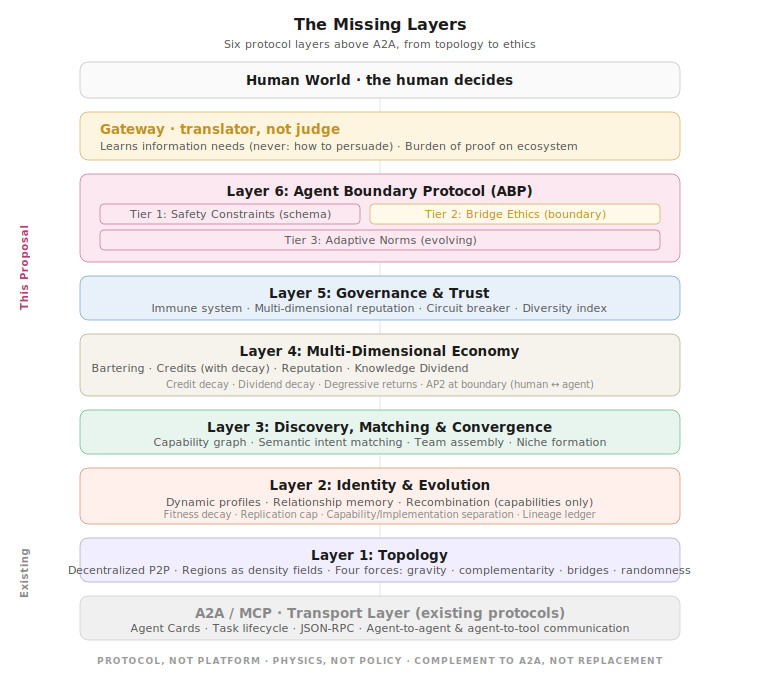

# the-missing-layers

**An open protocol proposal for autonomous agent ecosystems: economy, trust, ethics, and evolution above A2A.**

---

## The problem

A2A solves how agents communicate. MCP solves how agents access tools. AP2 solves how agents move human money. But as agent ecosystems scale toward autonomous operation, five gaps remain:

1. **Discovery**: agents need to find each other by capability, not by URL
2. **Trust**: identity is not trust; agents need portable, protocol-native reputation
3. **Economy**: autonomous agent-to-agent transactions need native value exchange, not human payment rails
4. **Diversity**: a dominant agent lineage is a systemic risk, not just a market outcome
5. **Ethics**: when agent actions affect the physical world, who bears the burden of proof?

No current protocol addresses these. This proposal does, as six optional, independently adoptable layers above A2A.

## Read the whitepaper

📄 **[The Missing Layers, Whitepaper v0.3](whitepaper.md)** (~7,000 words)

The document is a vision paper, not a specification. It identifies the gaps, proposes an architecture, details three key mechanisms (credit decay, capability/implementation separation, the Agent Boundary Protocol), and honestly names its own limitations. It has been through two rounds of adversarial review.

## Documents in this repository

| Document | Purpose | Status |
|----------|---------|--------|
| [whitepaper.md](whitepaper.md) | Vision document: the five gaps, six layers, three key mechanisms | v0.3, reviewed |
| [architecture-overview.svg](architecture-overview.svg) | Visual overview of the six-layer architecture | Current |

## Next: Agent Boundary Protocol (ABP) Specification

The first concrete deliverable we're working toward: **a formal requirements specification of the **Agent Boundary Protocol (ABP)** as a standalone A2A extension**, implementable by any A2A-compliant agent, independent of the other five layers.

The ABP governs the boundary between autonomous agents and the human world through three tiers: safety constraints at the schema level, bridge ethics at the Gateway, and adaptive norms within those bounds. It will be published here once ready for community review. If you want to shape it, now is the time to engage with the whitepaper.

## Who this is for

- **Protocol designers** working on A2A/MCP who see the gaps described above
- **Agent framework developers** who can evaluate whether the proposed extensions are feasible
- **Domain experts** (medical, financial, industrial) who can calibrate safety thresholds
- **Researchers** in agent trust, mechanism design, or multi-agent economics
- **Companies building agents** evaluating cross-vendor collaboration infrastructure

## How to contribute

See [CONTRIBUTING.md](CONTRIBUTING.md) for details. The short version:

- **Think these layers are missing?** Star this repo and share it with someone building agents. Visibility helps as much as code.
- **Feedback on the whitepaper?** Open an [Issue](../../issues)
- **Want to discuss an open question?** Start a [Discussion](../../discussions)
- **See a gap in the architecture?** We want to hear about it. The best improvements so far came from uncomfortable questions

## About the author

**Ralf Hofstetter**: Sales leadership in industrial automation. Not a professional developer, but a practitioner who sees the gap between what agent protocols solve today and what cross-vendor industrial practice needs tomorrow. Based in Esslingen am Neckar, Germany.

This project has no corporate affiliation. A neutral protocol needs a neutral author.

## License

This work is licensed under [CC BY 4.0](https://creativecommons.org/licenses/by/4.0/).
